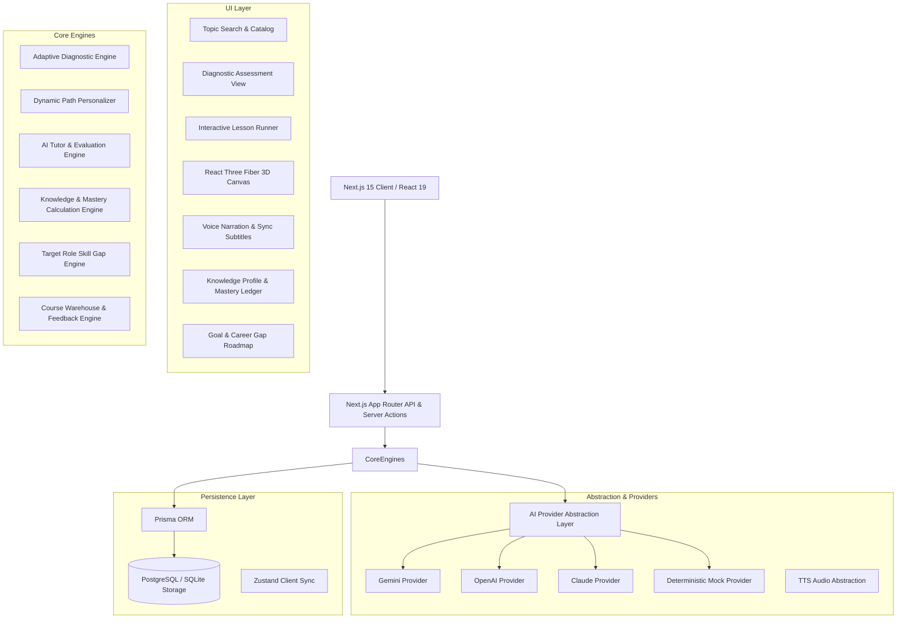

# SYSTEM ARCHITECTURE

## Architecture Principles
1. **Unbreakable Fallbacks**: System operates deterministically with zero API keys using the high-fidelity Mock Provider, while seamlessly tapping Gemini/OpenAI when keys are present.
2. **Data-Driven Visuals**: The AI Tutor selects from a curated catalog of procedural 3D React Three Fiber visual templates rather than generating unverified raw 3D code.
3. **Multi-Factor State Persistence**: Knowledge scores are computed from verifiable evidence (diagnostics, checkpoint proofs, exercises) stored in the relational database.
